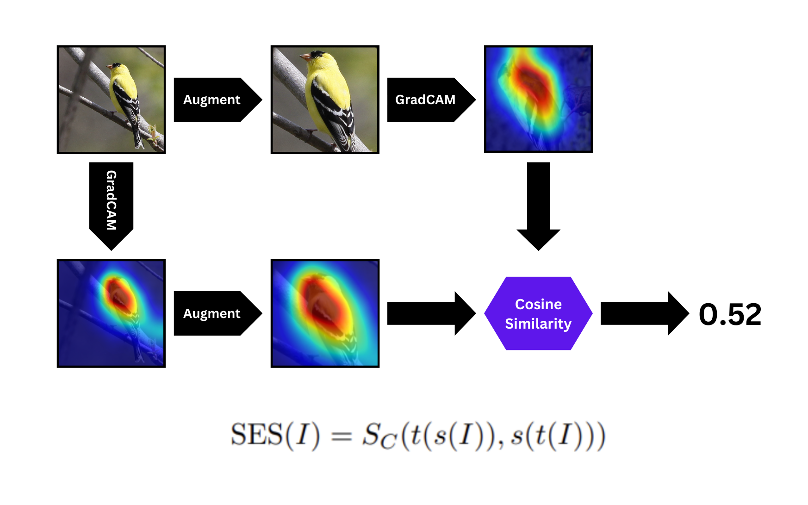
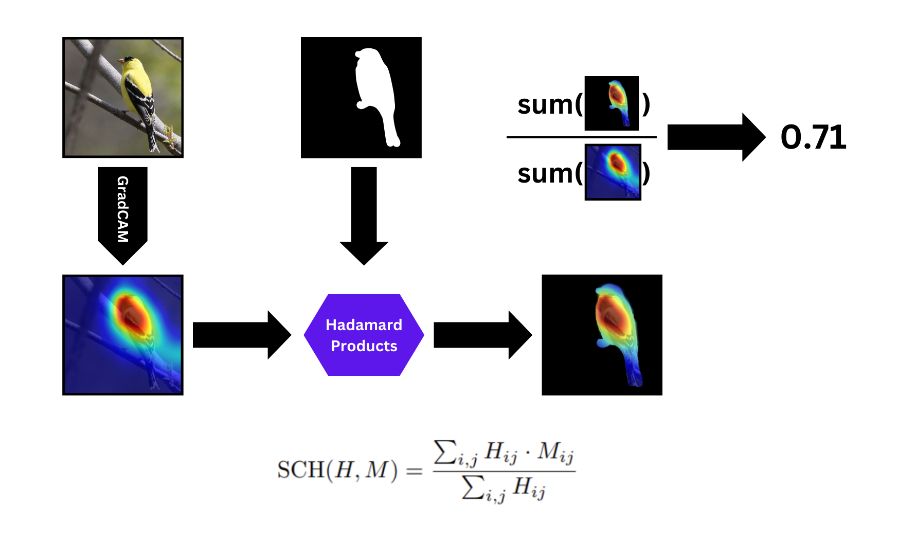
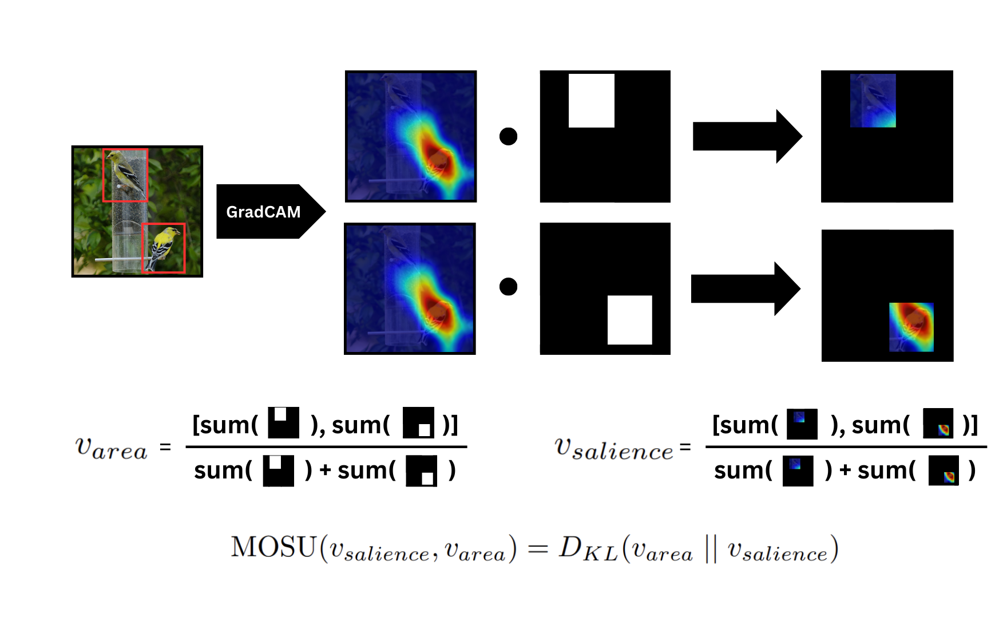

## Reproduction of "Language-Image COnsistency"
**Authors:** #################

This repository contains the codebase used in our reproduction study of "Language-Image COnsistency" 
by Lei et al. (https://arxiv.org/abs/2310.09821).

### Training

Our re-implementation of LICO method allows for simple training of the models by executing a single command.
The code for training has been implemented using PyTorch Lightning and uses W&B for logging.

The command to use to and its parameters are displayed below:

```bash
python main.py 
  --dataset $dataset
  --data $path_to_data
  --arch $arch 
  --epochs $epochs
  --lr $lr
  --training-method $training_method
  --alpha $alpha
  --beta $beta
  --seed $seed
  --workers $workers
  --context_position $context_position
  --enable_cls_prompts (optional)
```
where:
- ```$dataset``` - type of the dataset to use [allowed values: 'imagenet', 'imagenet-s50', 'cifar100']
- ```$path_to_data``` - path to the folder with data, containing 'train' and 'val' folders
- ```$arch``` - model architecture to use as the of visual encoder [allowed values: 'resnet18', 'resnet50']
- ```$epochs``` - number of training epochs (default: 40)
- ```$lr``` - initial learning rate (default: 3e-2)
- ```$training_method``` - training method to use for training [allowed value: 'baseline', 'LICO']
- ```$alpha``` - alpha hyperparameter of LICO
- ```$beta``` - bet hyperparameter of LICO
- ```$seed``` - seed used for training
- ```$workers``` - number of data loading workers
- ```$context_position``` - position of **CLASS LABEL** in the text prompt of LICO method [allowed value: 'front', 'end']
### Evaluation

The evaluation code is available within the "eval" folder on this repository. It consists of 
three runnable files: consistency_evaluation.py (Salience Equaivariance Score), 
segmentation_evaluation.py (Segmentation Content Heatmap) and multi_instance_evaluation.py (Multi-Object Saliency Uniformity).

Additionally, the Jupyter Notebook for interpretability experiments in available under "interpretability_evaluation.ipynb".

The dataset used for the full evaluation in our reproducibility paper was ImageNet-S_$_{50}$, which can be downloaded using https://github.com/LUSSeg/ImageNet-S and is expected to include the following folders:
- validation (renamed to "val") - validation data from ImageNet-S_$_{50}$ in ImageFolder-compliant folder structure
- validation-segmentation - segmentation masks for validation set
- annotations/val - folder with bounding box information (not provided by ImageNet-S_$_{50}$, has to be manually downloaded from full ImageNet1k)

We also share the pretrained models from our experiments (all trained with seed=2; the entire .ckpt file must be downloaded):
- [ResNet18 baseline](https://drive.google.com/file/d/1UhT2BxxjZipG5FJJ4A5-GN1o_7v6CQ8R/view?usp=sharing)
- [ResNet18 + LICO](https://drive.google.com/file/d/1a3RUseiCLeZQgf9U5QJ8jK5iW3VK7Bl6/view?usp=sharing)
- [ResNet18 + only MM loss](https://drive.google.com/file/d/1CID-NWYyM6vse3iy4E32kYILxD7MBdxm/view?usp=sharing)
- [ResNet18 + only OT loss](https://drive.google.com/file/d/1zIFnZEQHAuY8CUOZHulOmr_gIpmFW85N/view?usp=sharing)
- [ResNet18 + LICO with class tokens at the front of the prompt](https://drive.google.com/file/d/1LSDx8-QVazENV7P8hfQlJDeX9H9AeA0L/view?usp=sharing)
- [ResNet18 + LICO with trainable context tokens separate between classes](https://drive.google.com/file/d/1l76iUfXKp2y4OCsemjUIbN7nA6Pg12sw/view?usp=sharing)

#### Salience Equivariance Score

**Salience Equivariance Score** (**SES**) is a measure used to measure the equivariance of explanations generated for a model 
to affine image transforms. Higher values on this metric indicate that the model's explanations are more robust to changes 
in the input image.



The evaluation on SES can by run by:
```bash
python -m eval.consistency_evaluation 
  --pretrained (optional)
  --ckpt-path $ckpt_path
  --dataset $dataset 
  --save-dir $save_dir
```
where:
- ```--pretrained``` - use instead of ```--ckpt_path``` load a pretrained weights of PyTorch model 
- ```$ckpt_path``` - path to the model checkpoint that should be used for evaluation
- ```$dataset``` - name of the folder (within "data" folder) containing the "val" folder with validation images - in other words, 
"data/{$dataset}/val" should exist and contain validation images to use
- ```$save_dir``` - folder within consistency-output, where the results of SES evaluation should be saved, with final path being: "consistency-output/{$save_dir}"

#### Segmentation Content Heatmap

**Segmentation Content Heatmap** (**SCH**) is a metric validating whether the salience for a target class is located within
the boundaries of an object belonging to that class, based on its segmentation mask. High SCH indicates that the model 
makes decisions majorly based on the features lying within desired objects and not spurious features.



The evaluation on SCH can be run as:

```bash
python -m eval.segmentation_evaluation
  --pretrained (optional)
  --ckpt-path $ckpt_path
  --arch $arch
  --training-method $training_method
  --dataset $dataset 
  --img-data $img_data
  --seg-data $seg_data
  --save-output $save_output
```
where 
- ```--pretrained``` - use instead of ```--ckpt_path``` load a pretrained weights of PyTorch model 
- ```$ckpt_path``` - path to the model checkpoint that should be used for evaluation
- ```$arch``` - model architecture for the image classification model (supported options: [resnet18])
- ```$training_method``` - the training method that was used to train the model (supported options: [baseline, lico])
- ```$dataset``` - specifies the type of dataset used in current evaluation (supported: [imagenet-s50])
- ```$img_data``` - path to the folder with validation images
- ```$seg_data``` - path to the folder with segmentation masks used for the validation images
- ```$save_output``` - path to the folder where the 'content_heatmap_cls.csv' (statistics per class) and 'content_heatmap.csv' (overall statistics) should be saved

#### Multi-Object Salience Uniformity

Designed to be used with validation images with multiple instances of the target class present, **Multi-Object Salience Uniformity** 
(**MOSU**) measures the degree to which a model takes into account all instances 
of the target class present in the image when making predictions. Lower values of MOSU indicate
that the attribution given to the instances is more proportional to the size of the bounding boxes of these instances.



The evaluation on MOSU can be run as:

```bash
python -m eval.multi_instance_evaluation
  --pretrained (optional)
  --ckpt-path $ckpt_path
  --arch $arch
  --training-method $training_method
  --dataset $dataset 
  --img-data $img_data
  --annotation-data $annotation_data
  --save-output $save_output
```
where 
- ```--pretrained``` - use instead of ```--ckpt_path``` load a pretrained weights of PyTorch model 
- ```$ckpt_path``` - path to the model checkpoint that should be used for evaluation
- ```$arch``` - model architecture for the image classification model (supported options: [resnet18])
- ```$training_method``` - the training method that was used to train the model (supported options: [baseline, lico])
- ```$dataset``` - specifies the type of dataset used in current evaluation (supported: [imagenet-s50])
- ```$img_data``` - path to the folder with validation images
- ```$annotation_data``` - path to the folder with bounding box annotations
- ```$save_output``` - path to the folder where the 'content_heatmap_cls.csv' (statistics per class) and 'content_heatmap.csv' (overall statistics) should be saved


